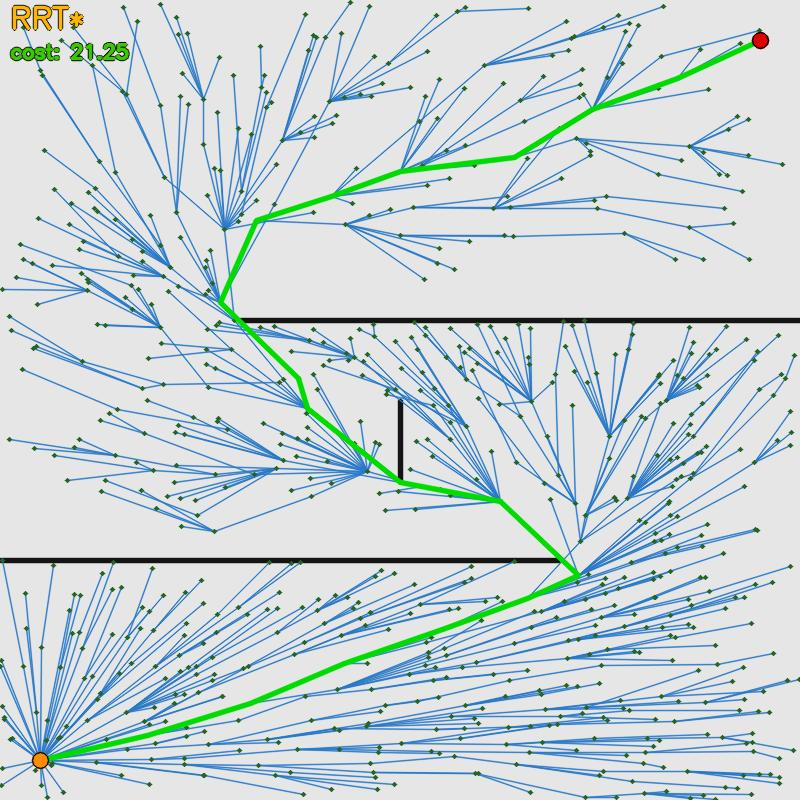

# motion_planning

A ROS 2 package that provides three executables for 2-D motion planning and
configuration-space (C-space) exploration of a two-link planar robotic arm.

---

## Overview

| Executable        | Source file                  | Purpose |
|-------------------|------------------------------|---------|
| `2d_optimization` | `src/2d_optimization.cpp`    | Interactive NLP-based trajectory planning in the task plane |
| `cspace_explorer` | `src/cspace_explorer.cpp`    | Interactive C-space visualisation of a two-link arm in a bin scene |
| `simple_rrt_demo` | `src/simple_rrt_demo.cpp`    | Step-by-step RRT / RRT* visualisation in a 2-D square world (OpenCV) |

Both nodes use **RViz interactive markers** so the user can drag inputs
(start, goal, obstacles, or end-effector) and see results update in real time.

---

## Packages & Dependencies

| Dependency            | Use |
|-----------------------|-----|
| `rclcpp`              | ROS 2 C++ client library |
| `geometry_msgs`       | `PoseStamped`, `Point` messages |
| `nav_msgs`            | `OccupancyGrid` for C-space map |
| `visualization_msgs`  | `MarkerArray` for RViz visualisation |
| `interactive_markers` | Draggable RViz markers |
| `tf2_eigen`           | Eigen ↔ ROS transform utilities |
| `angles`              | Angle normalisation helpers |
| `ifopt` + IPOPT       | NLP formulation and solver |
| `OpenCV`              | 2-D visualisation for `simple_rrt_demo` |
| `bin_picking`         | Shared types / scene description |
| `backward_ros`        | Pretty crash stack traces |

---

## Nodes

### `2d_optimization` — interactive 2-D trajectory planner

Plans a collision-free, minimum-length path between a draggable start and
goal through a set of draggable circular obstacles.  The path is represented
as an ordered list of **N waypoints** and computed by solving a Non-Linear
Programme with [IFOPT](https://github.com/ethz-adrl/ifopt) / IPOPT.

#### Subscribed topics
None (input via interactive markers).

#### Published topics
| Topic                | Type                             | Description |
|----------------------|----------------------------------|-------------|
| `trajectory_markers` | `visualization_msgs/MarkerArray` | Optimised path rendered as a blue line and green waypoint spheres |

#### Parameters
| Parameter       | Type   | Default | Description |
|-----------------|--------|---------|-------------|
| `n_segments`    | `int`  | `10`    | Number of waypoints in the trajectory |
| `obstacle_radius` | `double` | `0.5` | Radius of all circular obstacles (m) |
| `n_obstacles`   | `int`  | `2`     | Number of obstacles (placed uniformly on a 0.5 m circle at startup) |

#### Optimisation formulation

```
minimise    Σ ||q_{i+1} - q_i||²          (total squared path length)
subject to  ||q_0 - start||² + ||q_{N-1} - goal||² = 0   (endpoint pins)
            0.10 ≤ ||q_{i+1} - q_i|| ≤ obstacle_radius    (segment lengths)
            ||q_i - o_j||² ≥ r²  ∀ i, j                  (obstacle avoidance)
```

All constraint Jacobians are provided analytically.  The previous solution
is used as a warm-start on each re-plan to improve convergence speed.

---

### `cspace_explorer` — interactive C-space visualiser

Models a **two-link planar arm** inside a U-shaped bin.  At start-up it
computes the full C-space occupancy grid (1 000 × 1 000 collision checks)
and publishes it as a `nav_msgs/OccupancyGrid`.  The user can then drag
an interactive marker whose XY position is linearly mapped to (θ₁, θ₂),
moving the arm through configuration space in real time.

#### Published topics
| Topic                           | Type                              | Description |
|---------------------------------|-----------------------------------|-------------|
| `configuration_space_occupancy` | `nav_msgs/OccupancyGrid`          | Precomputed C-space collision map (latched) |
| `crowded_scene_markers`         | `visualization_msgs/MarkerArray`  | Bin walls + current arm pose |

#### Parameters
| Parameter                | Type     | Default | Description |
|--------------------------|----------|---------|-------------|
| `root_link_length`       | `double` | `1.0`   | First link length (m) |
| `end_link_length`        | `double` | `1.0`   | Second link length (m) |
| `dist_from_obstacle`     | `double` | `0.5`   | Safety margin subtracted from wall Y-coordinates (m) |
| `bin_depth`              | `double` | `1.0`   | Bin depth in Y (m) |
| `bin_width`              | `double` | `1.0`   | Bin half-width (m) |
| `configuration_space_size` | `double` | `2.0` | Side length of the C-space grid in the RViz view (m) |

---

### `simple_rrt_demo` — step-by-step RRT / RRT* planner

Runs and visualises **RRT** or **RRT\*** in a square 2-D world using an OpenCV
window.  Obstacles are straight wall segments.  The tree grows step-by-step at
a configurable rate; once the goal is reached the best path is drawn in green.

- **RRT** stops growing after the first solution is found.
- **RRT\*** keeps running indefinitely, rewiring the tree to improve path cost;
  the current best cost is shown live on the display.



#### Published topics
None — output is purely visual via an OpenCV window.

#### Parameters
| Parameter       | Type     | Default | Description |
|-----------------|----------|---------|-------------|
| `world_size`    | `double` | `10.0`  | Side length of the square world |
| `start_x`       | `double` | `0.5`   | Start position X |
| `start_y`       | `double` | `0.5`   | Start position Y |
| `goal_x`        | `double` | `9.5`   | Goal position X |
| `goal_y`        | `double` | `9.5`   | Goal position Y |
| `max_step`      | `double` | `0.5`   | Maximum tree extension step length |
| `goal_bias`     | `double` | `0.1`   | Probability of sampling the goal directly |
| `goal_threshold`| `double` | `0.4`   | Distance at which the goal is considered reached |
| `rrt_star`      | `bool`   | `false` | Enable RRT\* rewiring (vs plain RRT) |
| `rewire_radius` | `double` | `1.5`   | Neighbourhood radius for RRT\* rewiring |
| `image_size`    | `int`    | `800`   | OpenCV window size in pixels (square) |
| `step_delay_ms` | `int`    | `10`    | Milliseconds between visualisation updates |
| `walls`         | `double[]` | *(zig-zag maze)* | Flat list `[x1,y1,x2,y2, …]` of wall segment endpoints |

#### Visualisation legend
| Colour | Meaning |
|--------|---------|
| Grey | Background |
| Black | Wall obstacles |
| Blue | RRT tree edges |
| Dark green (dots) | Tree nodes |
| Orange | Start point |
| Red | Goal point |
| Bright green | Best path found |

---

```bash
cd /path/to/workspace
colcon build --packages-select motion_planning
source install/setup.bash
```

## Running

### 2-D trajectory optimiser

```bash
ros2 run motion_planning 2d_optimization \
  --ros-args -p n_segments:=15 -p obstacle_radius:=0.4 -p n_obstacles:=3
```

Open RViz, add a **MarkerArray** display on `/trajectory_markers` and an
**InteractiveMarkers** display on `/traj_planning_markers/update`.

### C-space visualiser

```bash
ros2 run motion_planning cspace_explorer
```

Open RViz and add:
- **Map** display on `/configuration_space_occupancy`
- **MarkerArray** display on `/crowded_scene_markers`
- **InteractiveMarkers** display on `/end_effector_marker/update`

### RRT / RRT* demo

```bash
# Plain RRT (stops after first solution)
ros2 run motion_planning simple_rrt_demo

# RRT* (keeps refining — press q or ESC to quit)
ros2 run motion_planning simple_rrt_demo --ros-args -p rrt_star:=true

# Custom walls and faster stepping
ros2 run motion_planning simple_rrt_demo --ros-args \
  -p rrt_star:=true \
  -p step_delay_ms:=5 \
  -p "walls:=[0.0,4.0,6.0,4.0, 4.0,7.0,10.0,7.0]"
```

---

## Architecture

```
motion_planning/
├── include/motion_planning/
│   ├── 2d_optimization.hpp    # IFOPT variable/constraint/cost classes +
│   │                          #   plan2DTrajectory() entry point
│   └── crowded_scene.hpp      # CrowdedScene: FK, IK, collision, C-space grid
├── src/
│   ├── 2d_optimization.cpp    # TrajPlanning2DNode (interactive NLP planner)
│   ├── cspace_explorer.cpp    # C-space visualiser node
│   └── simple_rrt_demo.cpp    # RRT / RRT* step-by-step visualiser (OpenCV)
├── CMakeLists.txt
├── package.xml
└── README.md
```

### Key classes (in `2d_optimization.hpp`)

| Class | Role |
|-------|------|
| `Segments` | IFOPT variable set — N 2-D waypoints flattened to a 2N vector |
| `LengthCost` | Minimise total squared path length |
| `EndpointConstraint` | Pin first/last waypoints to start/goal |
| `PointCollisionConstraint` | Keep each waypoint outside circular obstacles |
| `LineCollisionConstraint` | Keep each segment edge outside obstacles (currently disabled) |
| `SegmentLengthConstraint` | Bound individual segment lengths to avoid degenerate solutions |
| `plan2DTrajectory()` | Convenience function: assembles and solves the full NLP |

---

## Notes & Known Limitations

- `LineCollisionConstraint` uses an **approximate Jacobian** (∂t/∂p ≈ 0)
  and is disabled by default.  Enable it in `plan2DTrajectory()` for stricter
  collision avoidance at the cost of slower convergence.
- The C-space grid computation in `cspace_explorer` is **blocking** and takes
  a few seconds for the default 1 000 × 1 000 resolution; reduce `n_divs`
  for faster startup.
- IPOPT `print_level` is set to `2` (minimal output).  Change it in
  `plan2DTrajectory()` for more or less solver verbosity.

