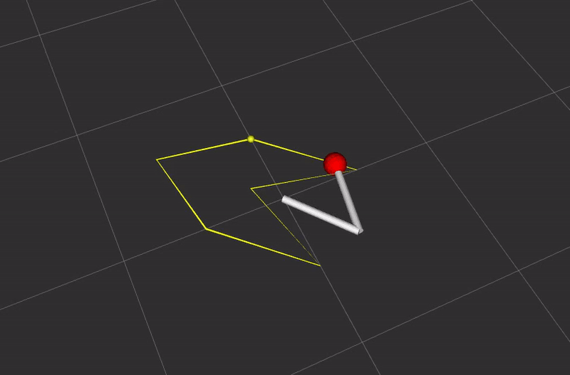

# Planar 2D manipulator

This package implements excercises from
[MIT Robotic Manipulation - Basic Pick and Place](https://manipulation.csail.mit.edu/pick.html)

## Usage
1. Build the package
1. Run node
```bash
ros2 run planar_manipulator planar_manipulator
```
1. Visualize marker array in RViz
1. Run joint_state_publisher_gui
```bash
ros2 run joint_state_publisher_gui joint_state_publisher_gui /home/ubuntu/manipulation/workspace/src/planar_manipulator/planar_manipulator.urdf
```
1. Play around with the manipulator (it also visualizes *manipulability ellipsoid*)
1. Also try the velocity control node, which uses differential inverse kinematics to lead the end-effector along a trajectory.
```bash
ros2 run planar_manipulator planar_manipulator_velocity_control
```

Check out the demo:
<p align="center">
  
</p>
